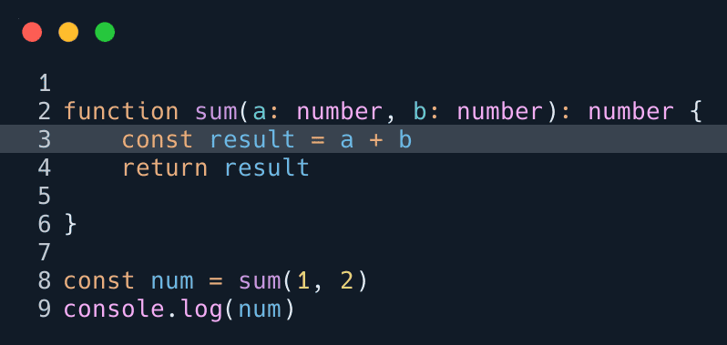

Back when I was using VS Code, taking code screenshots was very easy with the **CodeSnap** extension.
I wanted the same thing in Neovim, so I started searching for something similar.

I tried the popular **carbon-now.nvim**, but it opens your browser for every screenshot. You need an internet connection, and worse, the mouse to customize and save, not very Neovim-friendly. As a keyboard guy, I wanted something more native: just select the code, press a key, and the screenshot is saved automatically.

After looking for a better solution, I found **nvim-silicon**. Unlike **carbon-now.nvim**, it works entirely within Neovim and generates a clean screenshot in the root of your project directory.

> [!IMPORTANT]
> nvim-silicon is based on the **Silicon** command-line tool, so you need to install it first.  
> You can install it using your system's package manager. I use **pacman**, so for me, it would be
>
> ```bash
> pacman -S silicon
> ```

## Installation

To install the plugin using **Lazy.nvim**, add it inside your setup:

```lua
require('lazy').setup({
{
  'michaelrommel/nvim-silicon',
  lazy = true,
  cmd = 'Silicon',
  main = 'nvim-silicon',
  opts = {
        }

    }
})
```

## Configuration

You can change the theme, background, border radius, padding, and more.
For all available options, check <a href="https://github.com/michaelrommel/nvim-silicon?tab=readme-ov-file#setup" target="_blank" rel="noopener noreferrer">Plugin's GitHub page</a>.

```lua
  opts = {
    theme = 'Coldark-Dark',
    background = nil,
    no_round_corner = true,
    pad_horiz = 0,
    pad_vert = 0,
    shadow_blur_radius = 0,
        }
```

>[!Tip]
>Since this plugin is based on Silicon, to see all available themes, run in your terminal:
>
>```bash
>silicon --list-themes
>```

## Output Folder

By default, screenshots are saved in the root of your project.
You can change it to save all screenshots in a specific folder like this:

```lua
  opts = {
    output = function()
      return '~/Pictures/Code/' .. os.date '!%Y-%m-%dT%H-%M-%SZ' .. '_code.png'
    end,
  },
```

## Keybind

To take a screenshot, select the code in **visual mode**, and run the `Silicon` command in command mode.
But you can also create a keybind in your config:

```lua
vim.keymap.set('v', '<leader>ss', function()
  require('nvim-silicon').shoot()
end, { desc = 'Create code screenshot' })
```

Feel free to choose any keybind you prefer.

## Highlight a Line in the Screenshot

You can highlight a specific line by marking it. For example:

1. Go to the line you want to highlight
2. Set a mark with `mh` (`m` + `h`)

The marked line will be highlighted in the screenshot.


## Unsupported Files

Currently, some file types aren't supported. I tried to screenshot some code in a `.astro` file, which caused the following error:
<i class="text-orange-400">silicon returned with : [error] Unsupported language: astro</i>

To work around this, I made nvim-silicon treat `.astro` files as HTML:

```lua
  opts = {
    language = function()
      local fileType = vim.bo.filetype
      if fileType == 'astro' then
        return 'html'
      end
      return fileType
    end,
  },
```

## Conclusion

With **nvim-silicon**, taking code screenshots in Neovim is fast, simple, and fully keyboard-driven. Configure it once, and you can capture screenshots of your code directly in Neovim, without using a browser or mouse.
